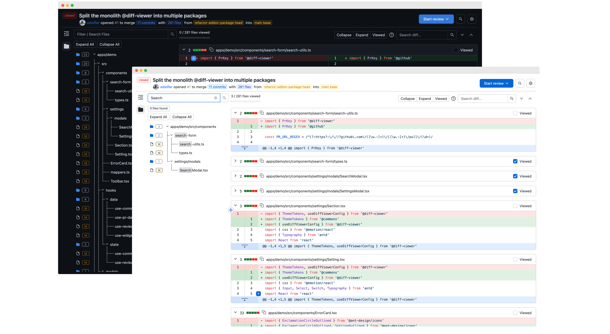

# Dialectica

A platform for code review, built on the principles of clarity, dialogue, and collaboration.

> _"Dialectic is the art of investigating or discussing the truth of opinions through logical argument, especially by examining contradictions between ideas."_

  

[Try it now!](https://edsilfer.github.io/dialectica/welcome)

## Current Status

This repository is **under development**. For now, the main working component is:

- [`@dialectica/diff-viewer`](./packages/diff-viewer/README.md): an accessible and extensible diff viewer component for modern web applications.

## License

This project is licensed under the [GNU AGPLv3](./LICENSE).
