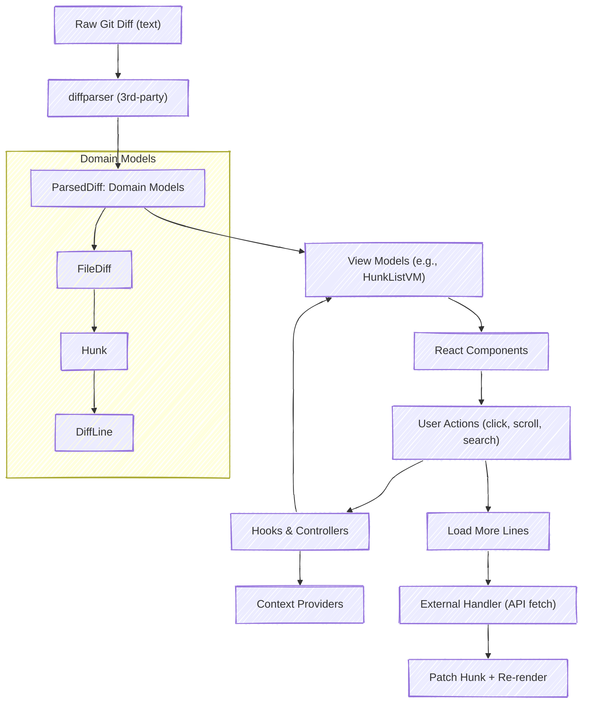

# @diff-viewer

A composable React library for building rich code review UIs. It provides diff viewers, file explorers, activity summaries, contextual commenting, and theming — all integrated, yet modular. Primarily intended for internal use within the Dialectica project.

[Try it now](https://todo) or

```bash
git clone git@github.com:your-org/dialectica.git
cd dialectica ; pnpm install ; pnpm demo
```

Main features

- **diff viewer (`<DiffViewer />`)** compatible with git / GitHub diff.
- **file-explorer** with support for scrolling to file, expand-collapse, search, file metadata, etc.
- **overlay API** that support rendering custom components over a line.
- **widget API** that allows easy doc of custom components on top of below a line/
- **theming** with 5 pre-configured themes and support for adding your own.
- **GitHub integration** via `./packages/github`

## API

```tsx
import { DiffViewer } from '@diff-viewer'

  /*
   * Supports for custom toolbar to render diff metadata. 
   */
  const toolbar = <Toolbar
    loading={loading.metadata}
    pr={metadata}
    isPosting={isPosting}
    comments={pendingComments}
    onSubmitReview={(payload) => onSubmitReview(payload, pendingComments)}
    commentDatastore={commentDs}
    onSearch={setPrUrl}
  />

  /*
   * Easily dusplay any custom component over the last docked line.
   */
  const overlays = [
    {
      unifiedDockIdx: 2,
      splitDockIdx: 1,
      content: <AddButton key="add-button" onClick={() => onCommentEvent(CommentEvent.ADD)} />,
      onDock: onLineDock,
    },
  ]

  /*
   * Easily dock any custom component on a line - perfect for inline comments.
   */
  const widgets = [
    {
      content: <CommentWidget key="comment-widget" />,
      line: 10,
      position: 'top',
      filepath: 'src/example.ts',
      side: 'right',
    },
  ]

  return (
    <DiffViewerConfigProvider
      theme={Themes.light}
      fileExplorerConfig={DEFAULT_FILE_EXPLORER_CONFIG}
      fileListConfig={DEFAULT_FILE_LIST_CONFIG}
      storage="local"
    >
      <DiffViewer
        diff={diff}
        isMetadataLoading={loading.metadata}
        isDiffLoading={loading.diff}
        onLoadMoreLines={loadMoreLines}
        onLineSelection={onLineSelection}
        highlightedLines={range}
        widgets={widgets}
        toolbar={toolbar}
        overlays={overlays}
      />
    </DiffViewerConfigProvider>
  )
```


## Architecture

The`@diff-viewer` package serves as the core rendering and state layer for visualizing diffs. It receives parsed diffs and renders them through a composition of layout, file, and line components, backed by domain models and theming providers.



**Package Structure**
```
packages/diff-viewer
├── src
│   ├── components        # All visual components (DiffViewer, FileList, etc.)
│   ├── models            # FileDiff, LineDiff, ParsedDiff, etc.
│   ├── providers         # Context providers for state, search, etc.
│   ├── hooks             # Reusable internal hooks
│   ├── utils             # Pure helpers and parsing logic
│   └── index.ts          # Main exports
├── vitest.config.ts
├── tsup.config.ts
└── package.json
```

[!image ]

## Status
This package is actively maintained but not currently designed for external consumption. APIs may change without notice as Dialectica evolves.

## License
