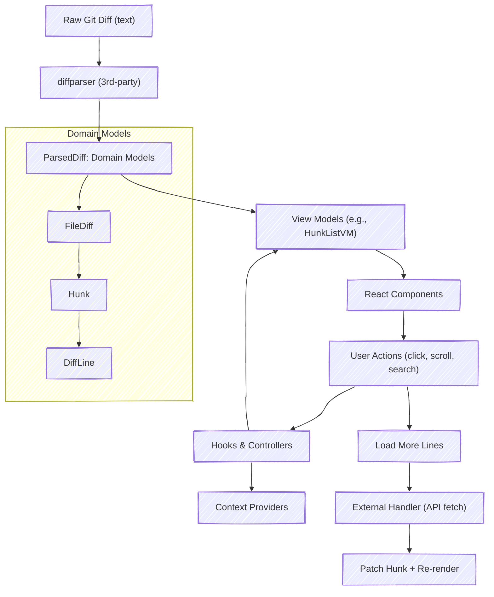

# @diff-viewer

**Note:** This package is open source but currently designed for internal use at Dialectica. It may not yet be production-ready for general external use.

<p align="center">
  
</p>

A composable React library for building rich code review UIs. It provides diff viewers, file explorers, activity summaries, contextual commenting, and theming — all integrated, yet modular. Primarily intended for internal use within the Dialectica project.

[Try it now](https://edsilfer.github.io/dialectica/) or

```bash
npm install @dialectica-org/diff-viewer @dialectica-org/commons
```

**Note:** `@dialectica-org/commons` is required!

```bash
git clone git@github.com:edsilfer/dialectica.git
cd dialectica ; pnpm install ; pnpm demo
```

Main features

<ul>
  <li><strong>Diff viewer (<code>&lt;DiffViewer /&gt;</code>)</strong> — compatible with git / GitHub diff.</li>
  <li><strong>File explorer</strong> — support for scrolling to file, expand/collapse, search, file metadata, etc.</li>
  <li><strong>Overlay API</strong> — supports rendering custom components over a line.</li>
  <li><strong>Widget API</strong> — allows easy docking of custom components above or below a line.</li>
  <li><strong>Theming</strong> — 5 pre-configured themes + support for adding your own.</li>
  <li><strong>GitHub integration</strong> — via <code>./packages/github</code>.</li>
  <li><strong>Virtual rows</strong> — enjoy better performance with virtualization.</li>
  <li><strong>Responsive layout</strong> — UI adapts to smaller screens.</li>
</ul>

## API

```tsx
import { DiffViewerConfigProvider, DiffViewer } from '@edsilfer/diff-viewer'

/*
 * Supports for custom toolbar to render diff metadata.
 */
const toolbar = (
  <Toolbar
    loading={loading.metadata}
    pr={metadata}
    isPosting={isPosting}
    comments={pendingComments}
    onSubmitReview={(payload) => onSubmitReview(payload, pendingComments)}
    commentDatastore={commentDs}
    onSearch={setPrUrl}
  />
)

/*
 * Easily display any custom component over the last docked line.
 */
const overlays = [
  {
    unifiedDockIdx: 2,
    splitDockIdx: 1,
    content: <AddButton key="add-button" onClick={() => onCommentEvent(CommentEvent.ADD)} />,
    onDock: onLineDock,
  },
]

/*
 * Easily dock any custom component on a line - perfect for inline comments.
 */
const widgets = [
  {
    content: <CommentWidget key="comment-widget" />,
    line: 10,
    position: 'top',
    filepath: 'src/example.ts',
    side: 'right',
  },
]

return (
  <DiffViewerConfigProvider
    theme={Themes.light}
    fileExplorerConfig={ ... }
    fileListConfig={ ... }
    storage="local"
  >
    <DiffViewer
      diff={diff}
      isMetadataLoading={loading.metadata}
      isDiffLoading={loading.diff}
      onLoadMoreLines={loadMoreLines}
      onLineSelection={onLineSelection}
      highlightedLines={range}
      widgets={widgets}
      toolbar={toolbar}
      overlays={overlays}
    />
  </DiffViewerConfigProvider>
)
```

## Architecture

The`@diff-viewer` package serves as the core rendering and state layer for visualizing diffs. It receives parsed diffs and renders them through a composition of layout, file, and line components, backed by domain models and theming providers.



**Package Structure**

```
packages/diff-viewer
├── src
│   ├── components        # All visual components (DiffViewer, FileList, etc.)
│   ├── models            # FileDiff, LineDiff, ParsedDiff, etc.
│   ├── providers         # Context providers for state, search, etc.
│   ├── hooks             # Reusable internal hooks
│   ├── utils             # Pure helpers and parsing logic
│   └── index.ts          # Main exports
├── vitest.config.ts
├── tsup.config.ts
└── package.json
```

## Contributing

We welcome feedback and improvements. Please open an issue or submit a pull request if you spot something.

## Versioning

This package uses semantic versioning. APIs may break between minor versions unless otherwise documented.

## License

- This project is licensed under the [GNU AGPLv3](./LICENSE).
- **Note:** The AGPL license requires source disclosure for any network-based use. Be sure to review its terms before using this in a proprietary environment.
